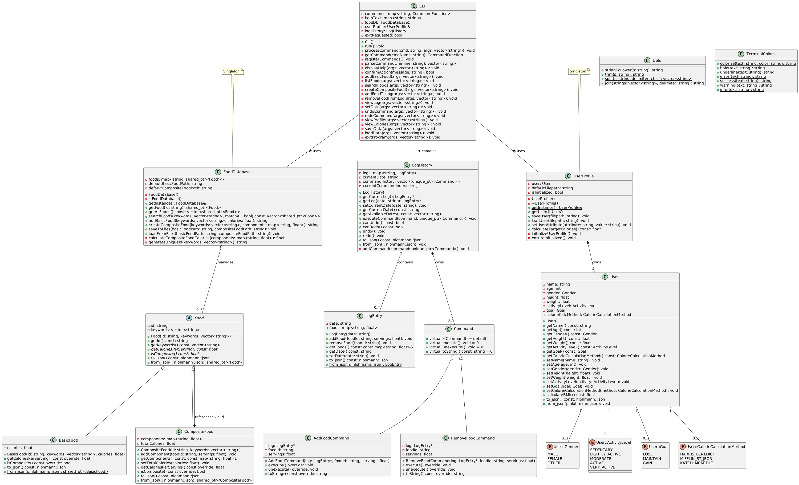
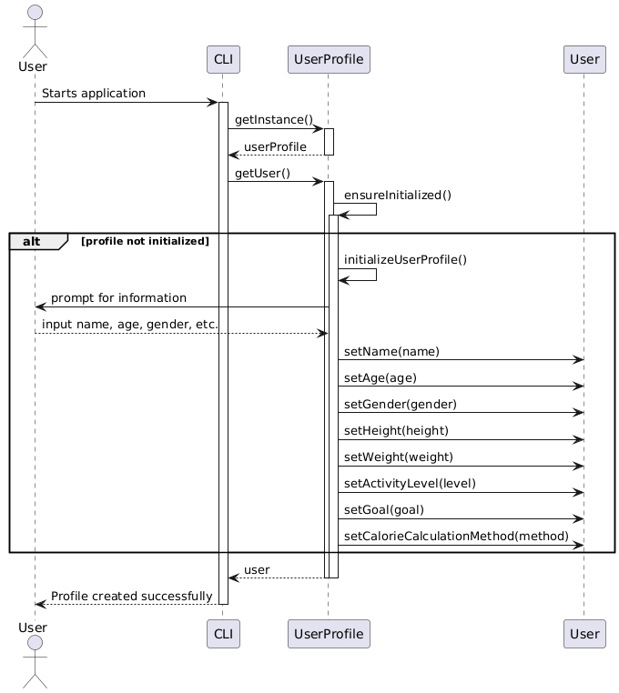
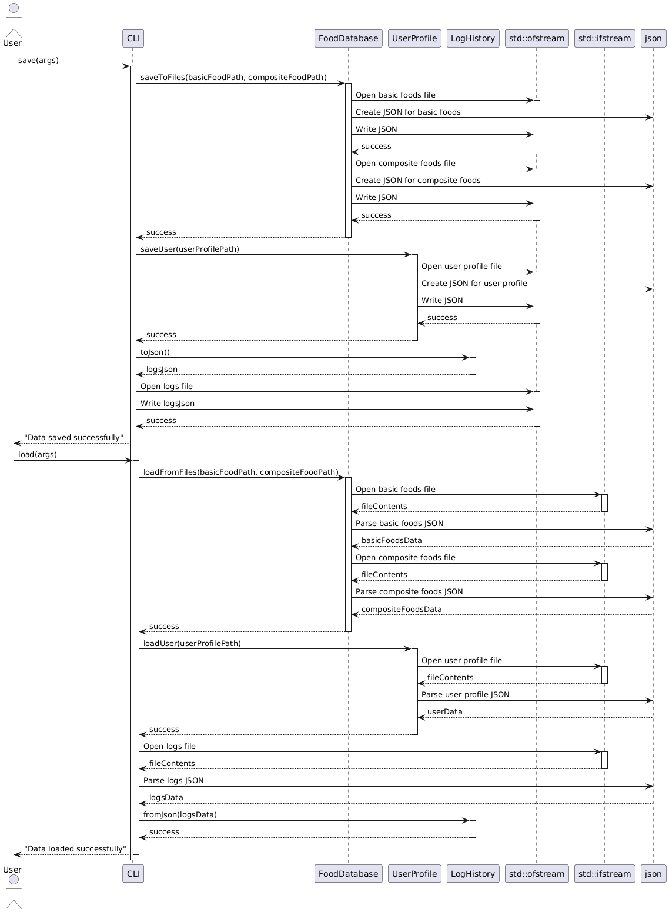
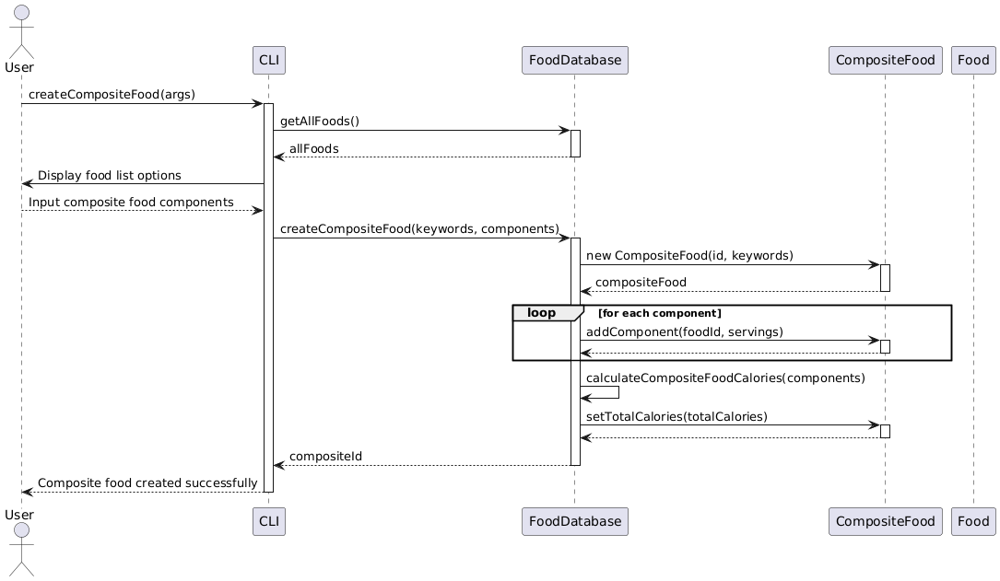
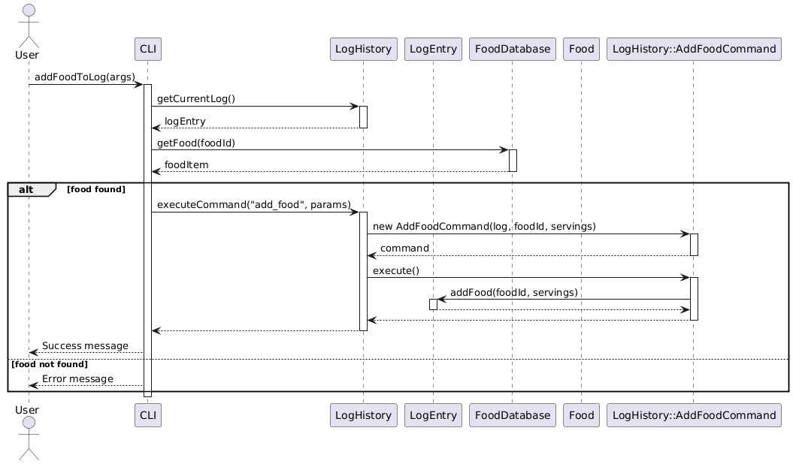
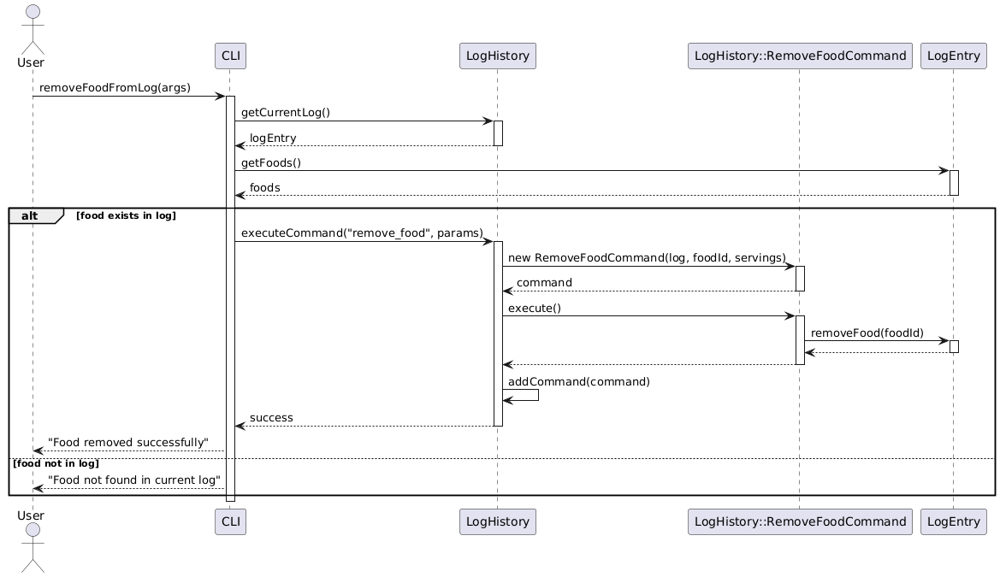
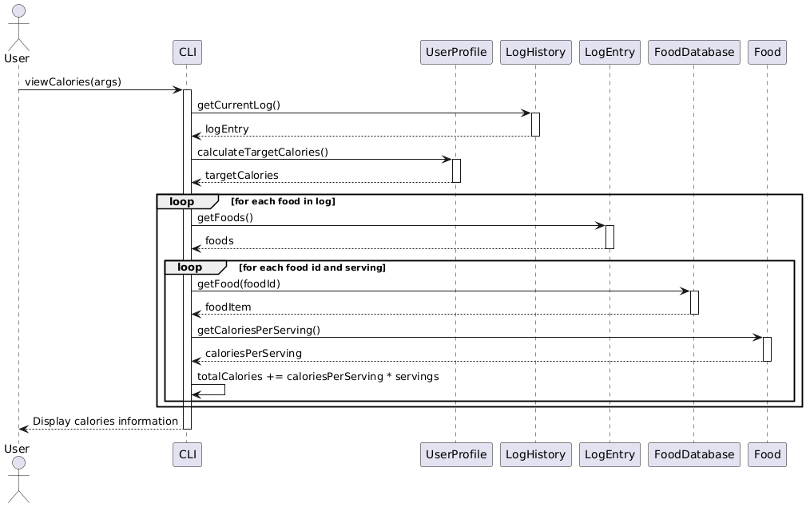
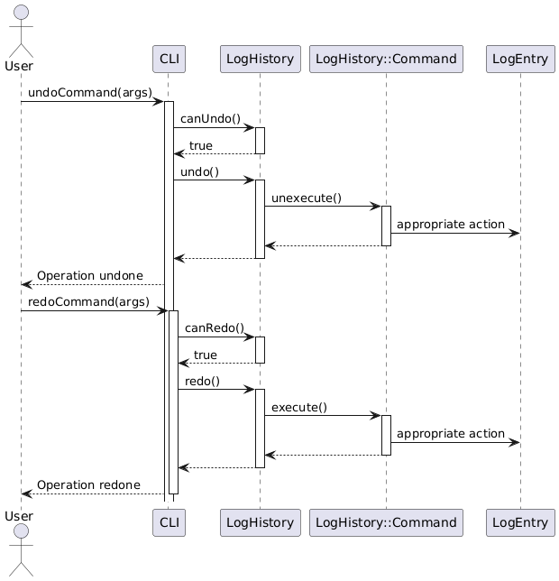
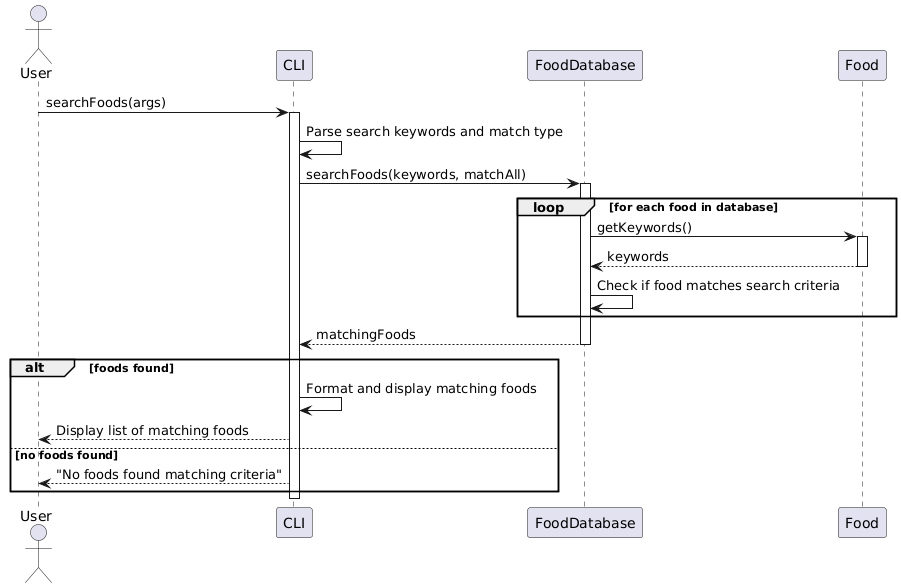

# YADA Diet Manager - Design Documentation

**Date:** April 8, 2025   
**Team Members:** Shreyas Deb, Vishak Kashyap K  
**Roll Nos:** 2023113024, 2023113012

## Overview

YADA is a command-line application designed to help users track their food consumption and manage dietary goals. The application allows users to maintain a database of food items, create composite foods from basic ingredients, log daily food intake, and track calorie consumption against personalized targets based on their profiles.

Key features include:
- Managing a database of basic and composite food items
- Tracking daily food consumption through dated logs
- Setting and adjusting personal profile information to calculate target calories
- Multiple calculation methods for determining daily calorie needs
- Undo/redo functionality for log operations
- Command-line interface for all interactions

## UML Class Diagram

## Sequence Diagrams

### 1. Initializing User Profile

### 2. Saving and Loading Data

### 3. Creating Composite Food

### 4. Adding Food to Food Log

### 5. Removing Food from Food Log

### 6. Viewing Calorie Information

### 7. Undoing and Redoing Actions

### 8. Searching for Food

## Design Principles and Considerations

In developing YADA Diet Manager, we carefully balanced several key design principles to create a maintainable, extensible, and robust application.

### Low Coupling and High Cohesion
We prioritized maintaining a clear separation between components while ensuring each class has a focused purpose. For example, our singleton implementation for FoodDatabase and UserProfile classes allows these managers to be accessed globally while encapsulating all database or user-related operations in a single place. This approach prevents scattered database access code throughout the application, reducing dependencies between components.

Each class in our design performs a specific, well-defined function:
- The Food hierarchy focuses solely on representing food items and their properties
- Manager classes (FoodDatabase, UserProfile) handle persistence and business logic
- The LogEntry and LogHistory classes manage food logs and their operations
- The User class encapsulates user profile information and settings
- The CLI class manages user interaction without directly manipulating data structures

This division of responsibilities creates classes that are both focused (high cohesion) and minimally dependent on each other (low coupling).

### Separation of Concerns
We implemented a clear layered architecture:
1. **Presentation layer**: The CLI class handles all user .
2. **Business logic layer**: Manager classes implement core functionality such as food management and logging and user profile management.
3. **Data layer**: Model classes represent domain entities and their relationships

This approach ensures that changes to the user interface won't affect data storage, and vice versa. For example, when adding a food to the log, the CLI doesn't need to know how logs are stored - it simply passes the command to LogHistory, which manages the implementation details. This abstraction between layers allows us to modify or replace components independently, enhancing maintainability.

### Information Hiding
Our classes expose clear public interfaces while hiding implementation details. For instance:
- The FoodDatabase hides the actual map of food items, providing accessor methods instead
- The LogHistory class encapsulates the complex undo/redo functionality behind simple methods
- The Command pattern keeps the details of specific operations hidden from the code that executes them

This approach allows us to change internal implementations without affecting other parts of the application, making the system more maintainable. This is loosely similar to the concept of "encapsulation" and "abstraction" in object-oriented programming, where we restrict access to certain components of an object to prevent unintended interference and misuse.

### Law of Demeter
We carefully designed interaction between components to follow the principle of least knowledge. Objects typically only communicate with their immediate neighbors:
- CLI talks to manager classes, not directly to model objects
- Commands know only about the specific LogEntry they modify, not the entire logging system
- Composite foods reference their components by ID rather than holding direct object references

This "don't talk to strangers" approach helps maintain a clean, understandable design with predictable information flow.

### Design Patterns
Strategic use of design patterns helped us address common challenges:
- **Singleton Pattern**: Ensures single instances of essential managers
- **Command Pattern**: Encapsulates log operations for flexible execution and undo capability
- **Composite Pattern**: Creates a unified interface for handling both simple and complex food items

## Design Reflections

After implementing YADA Diet Manager, we've reflected on the strengths and weaknesses of our design approach:

### Strongest Aspects

1. **Command Pattern for Logging Operations**: One of our most successful design decisions was implementing the Command pattern for food logging. This approach provides several benefits:
   - Clean undo/redo functionality with minimal additional code
   - Consistent mechanism for tracking and executing operations
   - Extensible architecture where new commands can be added without changing existing code
   - Historical record of user actions that could be used for analytics

   The pattern proved particularly valuable when implementing the CLI, as it created a clear separation between the user interface and the business logic for managing logs.

   The successful implementation of "abstraction" also allows us to extend the Command Line Interface (CLI) to a Graphical User Interface (GUI) in the future without needing to change the core logic of the application. This is because the CLI and GUI can both interact with the same command objects, allowing for a consistent user experience across different platforms.

2. **Composite Pattern for Food Hierarchy**: Our Food class hierarchy elegantly handles both basic ingredients and composite recipes through a unified interface. This implementation:
   - Simplifies calorie calculations with recursive composition
   - Provides a consistent API for all food types
   - Makes it easy to build complex food items from existing components
   - Enables food items to be treated polymorphically throughout the application

   This pattern proved especially powerful when implementing features like viewing logs and calculating calorie totals, as the same code works regardless of whether the food is basic or composite. This is thanks to the "inheritance" and "polymorphism" principles of object-oriented programming, which allow us to define a common interface for all food items and treat them uniformly.

### Areas for Improvement

1. **Input Validation Framework**: Our current approach to input validation is scattered throughout the CLI class, making it difficult to maintain consistent validation rules. A more robust solution would be:
   - A dedicated validation layer with reusable validators
   - Centralized error handling with descriptive messages
   - Separation of validation logic from command processing
   
   This would improve both code maintainability and user experience by providing more consistent and helpful feedback when invalid input is detected. The lack of input validation may also lead to unexpected behavior or crashes if users provide invalid data, which could be frustrating for users and difficult to debug.

2. **Serialization Strategy**: Our models currently handle their own JSON serialization, creating tight coupling with a specific format. A more flexible approach would be:
   - Implementing a Strategy pattern for serialization
   - Creating an abstraction layer between models and their persistence format
   - Supporting multiple serialization formats (JSON, XML, binary) through interchangeable strategies

   This change would make the application more adaptable to different storage requirements and would simplify testing by allowing mock serializers to be substituted.

Through our development process, we've learned that investing time in thoughtful design patterns pays dividends in maintainability and extensibility. While our current implementation successfully balances many competing design principles, we've identified clear opportunities for future refinement to make the system even more robust and flexible.

# Assumptions made

As the `Assignment-3` PDF only stated that:

> The database itself may consist of one file with both basic and composite foods, or two files, one for each category of food. The format of the database file(s) is up to you to decide, with the stipulation that these must be text files that can be viewed (and changed if necessary) in a standard text editor.

we took the liberty to implement the database as a series of JSON files in the `data` directory. The files are named `basic_foods.json`, `composite_foods.json`, `logs.json` and `user_profile.json`. The JSON format is human-readable and can be easily edited with a text editor, which meets the requirements of the assignment. 

Furthurmore, nothing was said about a `single-user` or `multi-user` implementation and hence, that too has been implemented as per our assumption of a `single-user`. However, if necessary, it is extendable by introducing an intersection class `UserFood` or  `UserLogs` that can be used to link the `User` class with the `Food` and `LogEntry` classes respectively. This would allow us to create a many-to-many relationship between users and food items, as well as between users and log entries, albeit these would require minor changes to the existing codebase.